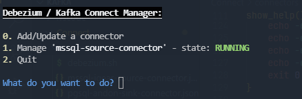
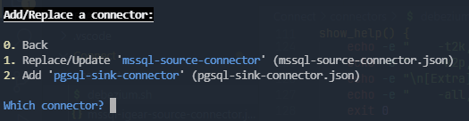
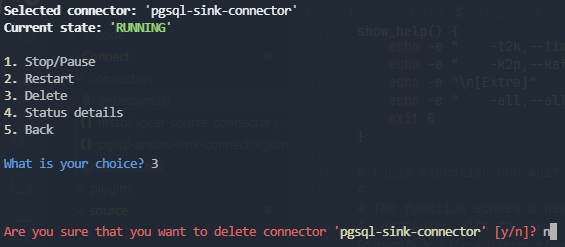

# Debezium Client - Connector Management Script

## Purpose

This Bash script provides a user-friendly interface for managing Debezium connectors in a Kafka Connect environment. It simplifies the process of creating, deleting, restarting, stopping, and checking the status of Debezium connectors.

## Main Features

1. **List Connectors**: Display all existing connectors in the Kafka Connect cluster.
2. **Create Connectors**: Add new connectors using JSON configuration files.
3. **Delete Connectors**: Remove existing connectors from the cluster.
4. **Restart Connectors**: Restart specific connectors or all connectors at once.
5. **Stop Connectors**: Pause the operation of specific connectors.
6. **Check Connector Status**: View the current status of a specific connector.

## How It Works

The script interacts with the Kafka Connect REST API to perform various operations on Debezium connectors. It uses `curl` for API requests and `jq` for parsing JSON responses.

Key components:
- Interactive menu for easy operation selection
- JSON file selection for connector configurations
- Error handling and user-friendly messages
- Color-coded output for better readability

## Prerequisites

- Bash shell
- `curl` for making HTTP requests
- `jq` for JSON parsing
- Access to a running Kafka Connect cluster with Debezium

## Usage

Run the script and follow the interactive prompts to manage your Debezium connectors.

```bash
./debezium-cli.sh
```

## Screenshots

### Main Menu


### Add/Update a Connector


### Manage a Connector

